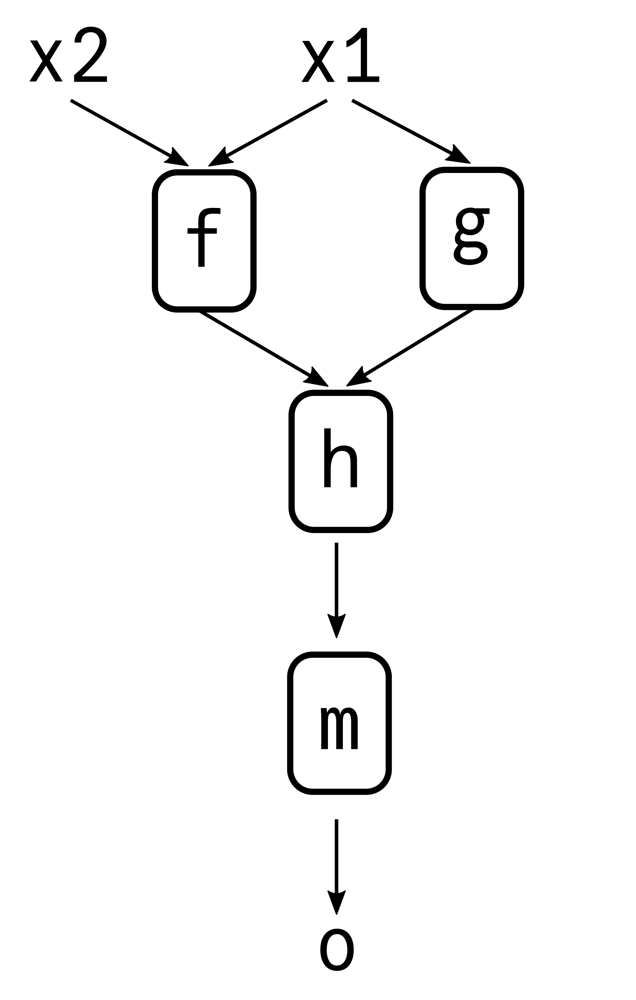

```@meta
DocTestSetup = quote
  using Stacks
  using Flux
end
```

# Introduction

*Adapted from [Transformers.jl](https://chengchingwen.github.io/Transformers.jl/dev/stacks/)*

Stacks.jl allows you to cleanly build flexible neural networks whose layers can take any number of inputs, and produce any number of outputs. It achieves this by seperating the *layers* themselves from the *structure* of the inputs/outputs the layers take in/produce. To accomplish this, this package provides two core features:
* `@nntopo`: A macro that uses a compact DSL (Domain Specific Language) to store the *structure* of the function composition in an `NNTopo`.
* `Stack`: Similar to a `Flux.Chain`, except it takes in an `NNTopo` as its first argument to determine which inputs to pass into each layer.  

## Stack
A `Stack` is quite similar to a `Flux.Chain` and indeed comes with many of the same features, such as parameter collection, indexing, slicing, etc. The big change is that the first input to a `Stack` is an `NNTopo`, which specifies *how* the layers should be called, This allows us to flexibly build complex architectures.

```@docs
Stack
```

As we can see, with the help of the `NNTopo`, the `Stack` not only holds information about the layers in a model, but also how to *call* the layers in a model as well.

## NNTopo
We store the structure of the model in a `NNTopo`, short for "Neural Network Topology". At its core, it is simply used to define inputs and outputs for each function in a sequence of function calls. Consider it a supercharged version of Julia's piping operator (`|>`). 

`NNTopo`s are usually created by using the `@nntopo` macro as shown:

```@docs
@nntopo
```

We now take a look at how `@nntopo` is used, as well a deep dive into the syntax used in `structure` in the following sections, so you can write your own ones for use in your own models!

### A first example

Suppose you have inputs `x1` and `x2` you want to pass through the functions `f`, `g` and `h` as follows to get the output `o`: 

```@raw html
<p align="center">

</p>
```

You could do the following in regular Julia:

```julia
a = f(x1, x2)
b = g(x1)
c = h(a, b)
o = m(c)
```

This is functional, but gets increasingly unwieldy as the number of functions/layers in your models grow. With the Stacks.jl approach, we seperate the *structure* from the actual *function calls*. In this case, we first define the structure as follows:

```julia
topo = @nntopo (x1, x2):(x1, x2) => a:x1 => b:(a, b) => c => o
```

The `@nntopo` macro then takes the information given, and produces the `NNTopo` instance `topo` that knows *how* to call the functions, once given the functions: 

```julia
topo
# NNTopo{"(x1, x2):(x1, x2) => (a:x1 => (b:(a, b) => (c => o)))"}
# function(model, x1, x2)
#     a = model[1](x1, x2)
#     b = model[2](x1)
#     c = model[3](a, b)
#     o = model[4](c)
#     o
# end
```

Here, `model` stands in for an iterable (e.g. a `Tuple` or `Vector`) of functions and layers. While the most typical use of an `NNTopo` will be to use it as input to a `Stack`, we can indeed use `topo` directly by passing in the functions and inputs:

```julia
x1 = 3
x2 = 2

f(x, y) = x^2 - y
g(x) = x^3
h(x, y) = x + y
m(x) = mod(x, 4)

topo((f, g, h, m), x1, x2) # 2
```

Let's take a deep dive into the syntax used in defining the `structure` here.

### The syntax of NNTopo
#### 1. Variable names
We use multiple variable names when defining the structure (e.g. `x`, `c`, etc.). These are the names of the intermediate outputs in the function generated by `NNTopo`. Similar to how `x` in `g(x) = x^3` has no relation with a previously defined `x` in the Julia session, the variables used to specify the structure have no relation with previously defined variables.

#### 2. Applying functions
Each application of a function is represented with a `=>`, with the input variables on the left and output variables on the right. For instance, `a => b` means "take the variable `a` and pass it to the function to produce the output `b`. This also allows us to chain functions together. Suppose you want to chain the functions `p`, `q` and `r` as follows: 

```julia
y = r(q(p(x))) 
```

You could equivalently write the following with the Stacks.jl approach, seperating the *structure* from the *functions*:

```
julia
topo = @nntopo x:x => a:a => b:b => y 
y = topo((p, q, r), x) 
```

When the actual function calls are made, the functions are used in the order they were passed in. Here the tuple of functions is `(p, q, r)` and so the first arrow in `structure` corresponds to applying the first function `p`, the second arrow applies `q`, and so forth.


#### 3. Seperating inputs and outputs
Notice that we use a `:` to seperate the input/output variable names for each function call. If the `:` is not present, we will by default assume that all output variables are the inputs of the next function call. This can be used to simplify `structure`s. Above, we wrote

```julia
@nntopo x:x => a:a => b:b => y 
```

when we could just as well have written

```julia
@nntopo x => a => b => y 
```

#### 4. Multiple inputs and outputs
When a function has multiple inputs/outputs, we use a *tuple* of variables instead of variables. For instance, a function that takes two inputs and produces three outputs would be specified as `(a, b) => (x, y, z)`

The core promise of Stacks.jl isn't just to enable skip connections of course, but to enable you to cleanly write complex multi-input multi-output models

#### Summary
The complete syntax for a `structure` can then be viewed as:
    
    (input arguments):(function1 inputs) => (function1 outputs):(function2 inputs):(function2 outputs) => .... => (function_n outputs):(return variables)

### Repeated Substructures

Suppose in the structure of your model, there are repeated substructures. For instance, suppose you have a pair of layers: 
* The first of which takes an output and produces two outputs
* The second takes two outputs and produces one output

And say that this pair structure is repeated 3x in your model. Instead of writing it out in full, you can do so more concisely with the following syntax:

```julia
topo = @nntopo (y => (z1, z2) => t) => 3
```

When the output of a `=>` is an integer `N` instead of a variable, instead of applying a function we *repeat* the sub-structure (specified in between the brackets `(` and `)`) N times. Indeed, we can see this produces the expected behavior:

```julia
topo 
# NNTopo{"(y => ((z1, z2) => t)) => 3"}
# function(model, y)
#     (z1, z2) = model[1](y)
#     t = model[2](z1, z2)
#     (z1, z2) = model[3](t)
#     t = model[4](z1, z2)
#     (z1, z2) = model[5](t)
#     t = model[6](z1, z2)
#     t
# end
```

### Nested repeated substructures
We can also nest our substructure repeats. For instance:

```julia
topo = @nntopo x => ((y => z => t) => 3 => w) => 2

topo
# NNTopo{"x => (((y => (z => t)) => (3 => w)) => 2)"}
# function(model, x)
#     y = model[1](x)
#     z = model[2](y)
#     t = model[3](z)
#     z = model[4](t)
#     t = model[5](z)
#     z = model[6](t)
#     t = model[7](z)
#     w = model[8](t)
#     z = model[9](w)
#     t = model[10](z)
#     z = model[11](t)
#     t = model[12](z)
#     z = model[13](t)
#     t = model[14](z)
#     w = model[15](t)
#     w
# end
```